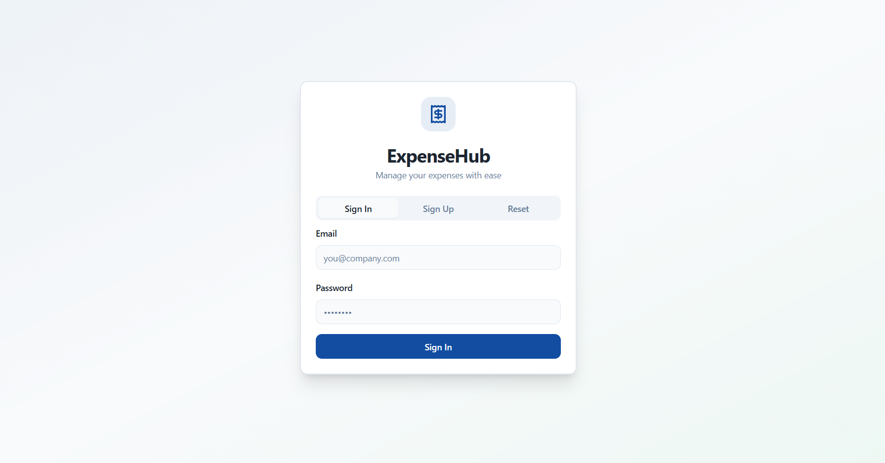

# Receipt Ace Hub

## Overview

Receipt Ace Hub is a modern expense management application built with React, TypeScript, and Supabase. This application provides a complete solution for managing expenses with role-based access control, multi-level approvals, and real-time tracking.

## Features

- Role-based dashboards (Admin, Manager, Employee)
- Expense submission and approval workflow
- Real-time tracking of expense status
- User management system
- Responsive design for all device sizes

## Technologies Used

- **Frontend**: React, TypeScript, Vite
- **UI Framework**: Tailwind CSS with shadcn/ui components
- **Backend**: Supabase (Authentication, Database)
- **State Management**: React Query
- **Routing**: React Router

## Getting Started

### Prerequisites

- Node.js (version 16 or higher)
- npm or yarn

### Installation

1. Clone the repository:

git clone https://github.com/kartik-parmar007/odoo-expense-management-system.git

text

2. Navigate to the project directory:
cd odoo-expense-management-system

text

3. Install dependencies:
npm install

text

4. Start the development server:
npm run dev

text
The application will be available at `http://localhost:8081`.

## Building for Production

To create a production build:
npm run build

text

To preview the production build locally:
npm run preview

text

## Project Structure

src/
├── components/ # Reusable UI components
├── hooks/ # Custom React hooks
├── integrations/ # Third-party service integrations
├── lib/ # Utility functions and helpers
├── pages/ # Page components
└── App.tsx # Main application component

text

## Developed For Odoo Virtual Hackathon 2025
This project was developed for the Odoo Virtual Hackathon 2025.